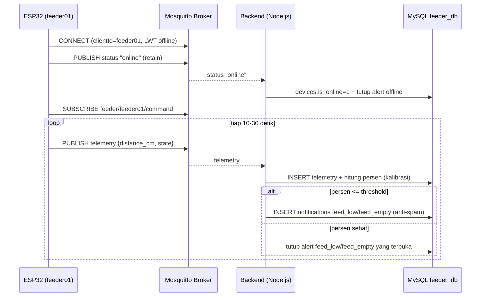
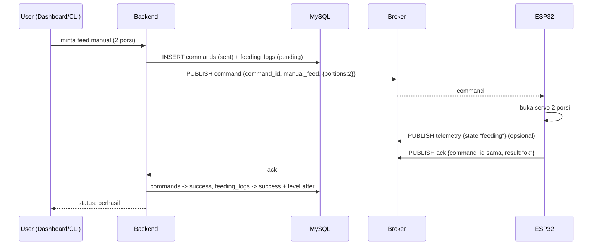
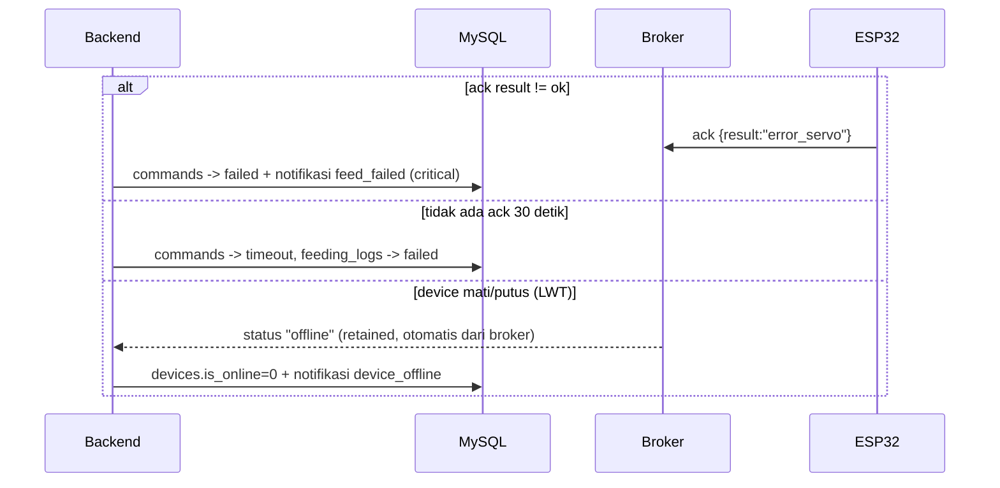

# Device Protocol — Kontrak MQTT untuk Firmware ESP32

> Referensi backend/dashboard: `MQTT_FOUNDATION_PLAN.md`, `DATABASE_PLAN.md`.
> Dokumen ini = "apa yang harus dilakukan device". Sudah tervalidasi E2E dengan
> `sim.js` + backend + database.

## 1. Koneksi

| Parameter | Nilai | Catatan |
|---|---|---|
| Broker | `mqtt://<IP-Mac-anda>:1883` | Mosquitto di Mac |
| ClientId | `feeder01` | **Harus unik & stabil** — jangan dipakai 2 proses (bug nyata: sesi saling tendang) |
| Keepalive | 60 s | |
| LWT (Will) | topic `feeder/feeder01/status`, payload `offline`, **retain=true** | Otomatis terpublish broker saat device mati |
| Saat connect | publish `online` ke `feeder/feeder01/status`, **retain=true** (birth) | Lalu subscribe command |

**Publish oleh device (3 topic):**

| Topic | Kapan | Format |
|---|---|---|
| `feeder/feeder01/status` | connect (birth) + LWT | string `online` / `offline` (bukan JSON) |
| `feeder/feeder01/telemetry` | periodik 10–30 s | JSON (lihat §2) |
| `feeder/feeder01/ack` | **wajib** balas tiap command | JSON (lihat §4) |

**Subscribe oleh device (1 topic):**

| Topic | Isi |
|---|---|
| `feeder/feeder01/command` | JSON perintah dari backend/dashboard (lihat §3) |

## 2. Payload Telemetry (device → platform)

Format target firmware (jarak mentah dari sensor ultrasonik — backend yang
menghitung persen dari kalibrasi di database):

```json
{
  "device": "feeder01",
  "state": "idle",
  "distance_cm": 12.5,
  "ts": "2026-09-23T13:00:00Z"
}
```

| Field | Wajib | Keterangan |
|---|---|---|
| `device` | ya | device_code (harus sama dengan clientId) |
| `state` | ya | `idle` / `feeding` / `error` |
| `distance_cm` | target utama | jarak sensor ke permukaan pakan (cm). Persen dihitung backend: `(empty_cm − distance) / (empty_cm − full_cm) × 100` |
| `feed_level_pct` | alternatif | boleh menggantikan `distance_cm` jika firmware sudah hitung sendiri persen |
| `ts` | opsional | ISO-8601; DB pakai waktu terima jika tidak ada |

Backend juga menerima format lama `{ "level": 50 }` (Node-RED) — kompatibel.

## 3. Payload Command (platform → device, device SUBSCRIBE)

```json
{
  "command_id": "cmd-ed239f2b-f305-46e6-8998-4fa7a4492986",
  "type": "manual_feed",
  "payload": { "portions": 2 },
  "timestamp": "2026-09-23T13:50:18Z"
}
```

| `type` | `payload` | Aksi device |
|---|---|---|
| `manual_feed` | `{ "portions": 2 }` | Jalankan servo × porsi, lalu ACK |
| `set_schedule` | `{ "schedules": [ { "id": 1, "feed_time": "07:00:00", "portions": 2 } ] }` | Simpan ke NVS/RTC, ACK |
| `set_threshold` | `{ "threshold_pct": 25 }` | Simpan, ACK |
| `set_rtc` | `{ "datetime": "2026-09-23T13:00:00" }` | Set RTC internal, ACK |
| `get_state` | `{}` | Balas state lengkap via ACK |

## 4. Payload Ack (device → platform, WAJIB untuk setiap command)

```json
{
  "command_id": "cmd-ed239f2b-f305-46e6-8998-4fa7a4492986",
  "result": "ok",
  "message": "feeding 2 portions",
  "ts": "2026-09-23T13:50:19Z"
}
```

Aturan:
- **`command_id` di-echo sama persis** — ini kunci korelasi di database.
- `result`: `"ok"` = sukses; nilai lain (`"error_low_level"`, `"error_servo"`, dst) = gagal
  → backend mencatat `failed` + membuat notifikasi `feed_failed`.
- **Tanpa ack dalam 30 detik** → backend menandai command `timeout`
  dan feeding_log `failed` (sudah otomatis).
- Ack dikirim meskipun perintah gagal dieksekusi (result error), bukan diam.

## 5. Sequence Diagram

### 5.1 Startup & Telemetry + Alert



### 5.2 Manual Feed (sukses)



### 5.3 Gagal / Timeout / Device Mati



## 6. Checklist Firmware ESP32

- [ ] ClientId unik + stabil (`feeder01`)
- [ ] Birth `online` (retain) + LWT `offline` (retain) di topic `status`
- [ ] Subscribe `feeder/feeder01/command`
- [ ] Publish telemetry periodik dengan `distance_cm`
- [ ] **Echo `command_id`** di setiap ack, kirim untuk sukses MAUPUN gagal
- [ ] State `feeding` saat motor jalan
- [ ] Reconnect otomatis + publish birth ulang saat sambungan kembali
